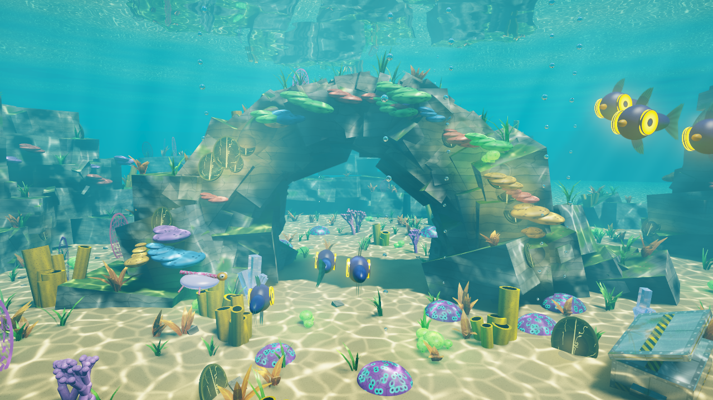
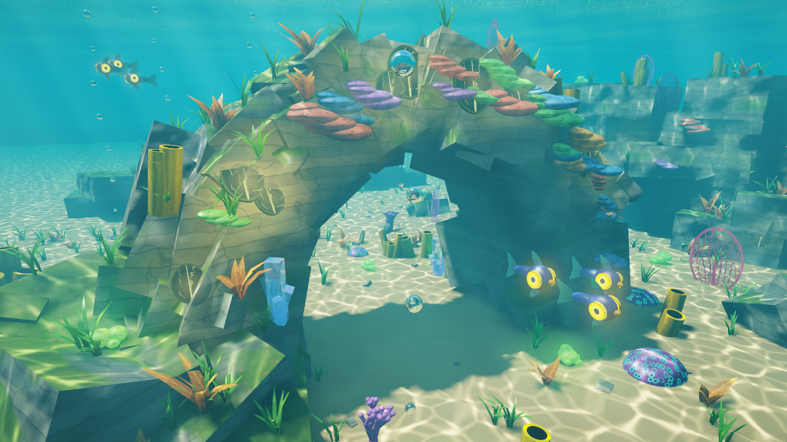
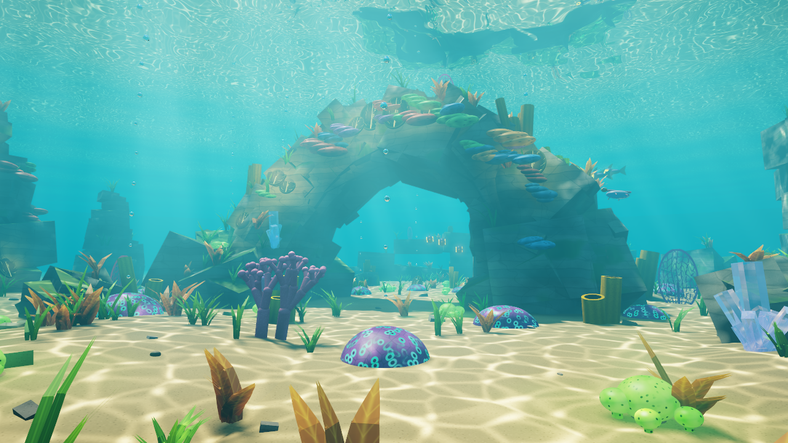

# Diorama subnautica con raytracing

Proyecto 2 de Gráficas por Computadora: un diorama basado en el juego *Subnautica*, 
renderizado con un **raytracer escrito desde cero en Rust, sin librerias externas (aparte de el pop up window)** 
que corre en la CPU. Todo está hecho con figuras básicas (cubos rotados, cilindros, elipsoides
y planos) Esta lleno de fauna y flora del juego, como: peepers, bladderfish, medusas, 
coral de mesa, placas venosas, coral cerebro, hongos ácidos y pasto rojo, además de un ciclo de día y noche.



| | |
|---|---|
|  |  |

> 🎥 **Video:** _(agregar aquí el enlace o el archivo del video del diorama)_

## Cómo ejecutarlo

Requisitos: Rust con el toolchain **MSVC** de Windows (el que instala `rustup` por defecto).
No hace falta instalar nada más: raylib ya viene incluido en el proyecto.

```powershell
cd Subnautica
cargo run --release
```

## Controles

| Tecla | Acción |
|---|---|
| Arrastrar con el mouse, `A`/`D`, `←`/`→` | Girar 360° alrededor del diorama |
| `W`/`S`, `↑`/`↓` | Inclinar la cámara |
| Rueda del mouse, `Q`/`E` | Alejar / acercar (zoom) |
| `R` | Giro automático (ideal para grabar el video) |
| `F` | **Modo buzo**: cámara libre. Mouse/flechas para mirar, `W` `A` `S` `D` para nadar, `E`/`Q` subir/bajar, `Shift` rápido. No deja salir del diorama ni atravesar rocas. `F` otra vez vuelve a la órbita |
| `N` | Cambiar entre día y noche (transición suave de ~4 s) |
| `C` | Ciclo automático de día y noche (2 minutos por vuelta) |
| `Y` | Ataque (sorpresa; solo se puede activar de nuevo cuando termina) |
| `Espacio` | Pausar la animación: la imagen se refina a resolución completa con antialiasing |
| `1` `2` `3` `4` / `0` | Calidad fija (33 %, 50 %, 75 %, 100 %) / automática |
| `P` o `F12` | Guardar una captura en alta calidad (`captura_XX.bmp`) |
| `H` | Ocultar / mostrar el HUD |
| `Esc` | Salir |

## Qué incluye (rúbrica)

**Rotación y zoom.** Cámara orbital de 360° con inclinación y zoom suavizados.

**Materiales (26).** Cada uno tiene su propia textura y sus propios
parámetros de albedo, especular, transparencia y reflectividad (se imprimen al iniciar):

| Material | Textura | Especular | Reflectividad | Transparencia | IOR |
|---|---|---|---|---|---|
| Arena | granos, manchas de algas, rizos (bump) | 0.05 | 0.01 | 0 | – |
| Roca | estratos sedimentarios, grietas, musgo arriba | 0.04 | 0.02 | 0 | – |
| Coral de mesa | "almohadas" con hoyuelos (verde, azul, morado, rojo) | 0.25 | 0.04 | 0 | – |
| Esponja tubo | poros y estrías, interior oscuro | 0.12 | 0.03 | 0 | – |
| Coral cerebro | domo morado con pólipos de anillo verde (brillan) | 0.30 | 0.06 | 0 | – |
| Coral ramificado | pólipos | 0.32 | 0.08 | 0 | – |
| Abanico de mar | red con recorte alfa | 0.08 | 0.02 | 0 | – |
| Pasto marino | venas, hoja con recorte alfa | 0.22 | 0.05 | 0 | – |
| Planta venosa | venas brillantes | 0.28 | 0.06 | 0 | – |
| **Cuarzo** | vetas y nubes internas | 1.40 | 0.12 + Fresnel | 0.82 | 1.52 |
| **Burbuja** | tono plateado | 2.50 | 0.05 + Fresnel | 0.97 | 0.75 (aire en agua) |
| **Superficie del agua** | red de olas | 3.00 | Fresnel / reflexión total | 1.00 | 1.333 |
| **Metal** (cápsula de suministros) | paneles, remaches, franja de peligro, óxido | 0.90 | 0.42 | 0 | – |
| Placa venosa | venas amarillas ramificadas que brillan | 0.35 | 0.07 | 0 | – |
| Hongo ácido | copa morada con gajos, hueco naranja-rosado que brilla | 0.40 | 0.08 | 0 | – |
| Peeper (cuerpo) | azul marino con pliegues | 0.45 | 0.06 | 0 | – |
| Peeper (ojo) | iris amarillo luminoso, pupila | 1.20 | 0.10 | 0 | – |
| Aleta | radios finos | 0.20 | 0.03 | 0 | – |
| Pico | naranja | 0.30 | 0.04 | 0 | – |
| **Bladderfish** (vejiga) | lila | 0.90 | 0.05 + Fresnel | 0.55 | 1.08 |
| Bladderfish (espina) | magenta con manchas turquesa | 0.35 | 0.05 | 0 | – |
| Ojo | blanco con pupila | 1.50 | 0.12 | 0 | – |
| Pasto rojo | hojas rojas con nervio | 0.15 | 0.03 | 0 | – |
| Medusa | campana morada, franja rosada con puntos | 0.90 | 0.10 | 0 | – |
| Tentáculo | azul claro | 0.60 | 0.05 | 0 | – |
| Medusa (espiral) | cinta azul-morada con puntitos | 0.40 | 0.05 | 0 | – |

**Refracción con sentido en la escena.**
- Cristales de cuarzo que salen de la arena (como en el juego)
- Burbujas de aire, como el aire tiene menor índice que el agua, sus bordes hacen
  reflexión interna total y se ven plateadas, igual que en la realidad.
- La superficie del agua vista desde abajo: **ventana de Snell** (se ve el cielo solo en
  un cono) y fuera de ella **reflexión interna total** (el fondo se refleja en la superficie).

**Reflexión.** La cápsula metálica refleja el arrecife; el cristal, las burbujas y el
agua usan Fresnel; los corales tienen un ligero brillo mojado.

**Skybox.** Dos cubemaps de 6 caras generados por código: el cielo sobre el mar
(sol, nubes) que se ve a través de la ventana de Snell, y el fondo submarino con
siluetas de rocas lejanas y haces de luz. El fondo también es el color de la niebla,
así que todo se funde con el skybox. Se pueden exportar como imágenes con
`cargo run --release -- --export-textures` (quedan en `Subnautica/assets/`).

**Fauna y flora del juego (con figuras simples)**
- **Peepers** (9, en 3 cardúmenes de 3): cuerpo de dos elipsoides, ojo de disco con
  iris amarillo que **emite luz** (ilumina lo que tiene cerca y deja un halo en el agua),
  pico, aletas y cola con recorte que se mueve al nadar. Un cardumen pasa por dentro del arco.
- **Bladderfish** (3, solitarios y lentos): vejiga lila transparente (refracta),
  espina con manchas, cabeza naranja, ojos y patitas.
- **Medusas** (2, debajo del arco): campana, 4 tentáculos y una cinta corta en espiral
  que se mecen; emiten una luz morada suave.
- **Stalker** (detrás del arco, a la izquierda): cuerpo alargado con rayas, hocico con
  dientes y placa morada, espinas en el lomo, aletas-patas y cola. Da vueltas despacio
  sobre unos restos de metal, como si los cuidara.
- **Coral de mesa** de colores, **placas venosas** con venas que brillan,
  **coral cerebro** grande (5, cada uno suelta una burbuja grande cada ~10 s), **hongos ácidos**
  en forma de copa y dos manchas de **pasto rojo** que se mueven con la corriente
  (también aparecen manchas rojas lejanas en el skybox).

**El ataque (`Y`).** Se escucha un rugido lejano y la música baja; unos segundos
después un **reaper leviathan** aparece desde el fondo (el skybox), cruza el centro
del diorama nadando rápido con su cuerpo ondulando, ruge fuerte (la música se
detiene) y desaparece por el otro lado. Al terminar la música vuelve. Está hecho
con elipsoides y cubos: cabeza con cresta roja, cuatro ojos, boca con dientes,
mandíbulas en forma de brazos rojos, cuerpo segmentado con franja roja, aletas y
cola en media luna.

**Sonido** (con raylib, la misma librería de la ventana): música de fondo
(*Salutations*) y ruido de agua suaves todo el tiempo; un sonido de agua al pasar cerca
de los peepers, un "blup" bajito cuando sale una burbuja de un coral cerebro y el
sonido del stalker (fuerte) cuando te acercas a él. Los archivos están en
`Subnautica/assets/audio/`.

**Día y noche.** De noche hay luz de luna azulada (sombras y cáusticas incluidas), el
agua y el skybox se oscurecen y todo lo que emite luz (ojos de peeper, medusas,
placas venosas, hongos, corales cerebro) resalta más.

**Efectos extra que dan vida a la escena**
- Cáusticas animadas sobre la arena y las rocas.
- Haces de luz volumétricos (god rays) con sombras.
- Niebla submarina física por canal (Beer-Lambert: el rojo se pierde primero).
- Sombras suaves del sol y oclusión ambiental (bajo el arco y en las grietas).
- Pasto, plantas y abanicos que se mecen con la corriente.
- Columnas de burbujas que suben desde los corales cerebro.
- Tonemapping ACES, viñeta y antialiasing progresivo.

## Optimización

Normalmente cada rayo pega contra todas las figuras y
lanza rayos de reflexión en todos los materiales. 
Luego de optimizar

- **BVH con SAH** (jerarquía de cajas): con ~12 000 figuras cada rayo prueba solo unas pocas.
- **Multihilo** con `std::thread::scope` (usa todos los núcleos del procesador).
- **Resolución dinámica**: ajusta la resolución interna para mantener ~30 FPS;
  al pausar, se refina a resolución completa por franjas sin congelar la ventana.
- **Sombras y oclusión precalculadas** al iniciar (mapa de sombras trazado con rayos y
  volumen de oclusión), así no se lanzan rayos de sombra en cada píxel.
- Rayos secundarios solo en materiales que los necesitan y cortados cuando su
  aporte es mínimo; matemáticas en `f32`; haces de luz calculados de forma incremental.

## Sobre raylib y las librerías

El `Cargo.toml` **no tiene dependencias**. raylib es la única librería externa y se usa
solo para abrir la ventana, leer teclado/mouse, reproducir el audio y mostrar la
imagen que calcula el raytracer. 

Opciones útiles: `cargo run --release -- --shot imagen.bmp --w 1920 --h 1080 --passes 16`
renderiza una imagen sin abrir la ventana (también acepta `--yaw`, `--pitch`, `--dist`, `--time`).
